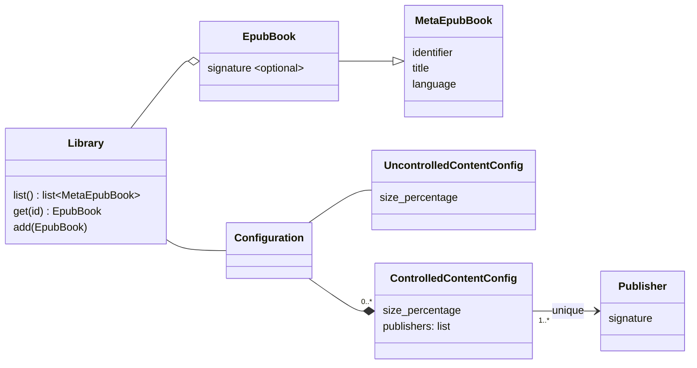

Library Architecture
================================================================================
As the intended implementation of a `Library` is for an embedded device, the API
is intentionally constrained. Applications with greater resources can leverage
this minimal API to provide more specialized user experiences (organizing
content, filtering content on parameters like language, etc).

The `MetaEpubBook` is defined by
https://www.w3.org/publishing/epub3/epub-packages.html#sec-metadata-elem.

Architectural Requirements
--------------------------------------------------------------------------------
* `EpubBooks` **shall** be stored "flatly" (aka in a single common folder)
    * Rationale: moving content around on storage is fragile and detracts from
        the primary objective of the `Library` to serve content.
* The total `size_percentage` of all configurations **shall** never exceed 100%.
* Changes to `size_percentage` **shall** only be allowed if current matching
    content doesn't exceed that limit.
* `ControlledContentConfig` publishers **shall** be unique (i.e. the same
    publisher can not be used within another `ControlledContentConfig`)
    * Rationale: allowing publishers to be aliased across
        `ControlledContentConfigs` would make `size_percentage` ambiguous.

Library Interface Requirements
--------------------------------------------------------------------------------
* Upon `list()`, `Library` **shall** return a listing of content metadata.
* Upon `get()`, `Library` **shall** return the specified ebook.
* Upon `add()`, `Library` **shall** only accept the ebook if the `Configuration`
    supports it's storage.